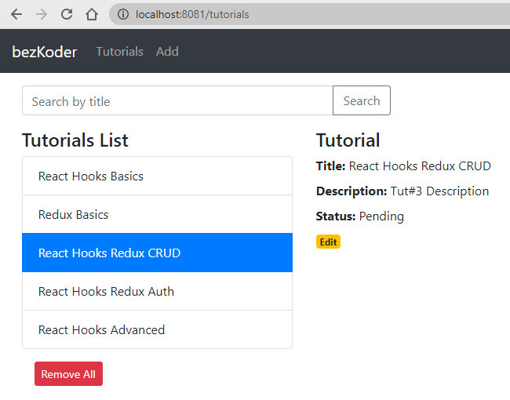
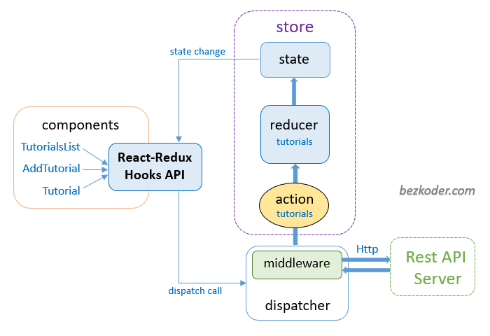

# Redux-Toolkit CRUD example with React Hooks, Axios & Web API
Build Redux-Toolkit CRUD application with React Hooks and Rest API calls in that:
- Each item has id, title, description, published status.
- We can create, retrieve, update, delete items.
- There is a Search bar for finding items by title.



Redux Store:




### Set port
.env
```
PORT=8081
```

## Project setup

In the project directory, you can run:

```
npm install
# or
yarn install
```

or

### Compiles and hot-reloads for development

```
npm start
# or
yarn start
```

Open [http://localhost:8081](http://localhost:8081) to view it in the browser.

The page will reload if you make edits.
